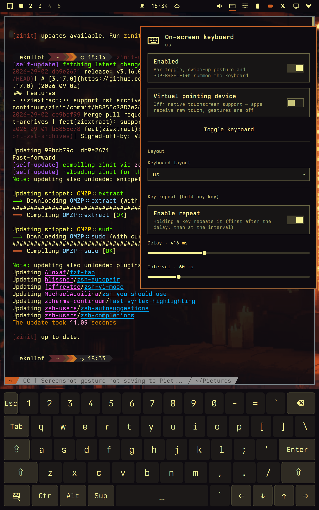

# omarchy-osk

On-screen keyboard + virtual touchscreen pointer device for
[Omarchy](https://omarchy.org) (Hyprland + Quickshell). Turns a touchscreen
laptop/tablet into a fully usable machine without a physical keyboard: the
compositor plugin consumes all touchscreen input and re-emits it as pointer
input, while the on-screen keyboard injects text and key events into whatever
window has focus — exactly like wvkbd, but native to the Omarchy shell.

<p align="center">
  
</p>

## Components

| Component | What it is |
|---|---|
| `hypr-osk/` | Hyprland compositor plugin (C++23, meson): touch→pointer emulation, a synthetic keyboard device, and a unix-socket IPC server |
| `shell/ekollof.osk/` | Quickshell overlay plugin: the visible keyboard (wvkbd-style terminal layout) |
| `shell/ekollof.osk-applet/` | Bar widget: enable/disable, show/hide, layout picker, key-repeat settings |
| `hypr/osk.lua` | Hyprland integration: plugin autostart, gesture bind, SUPER+SHIFT+K |
| `hypr/osk-toggle.sh` | Debounced toggle script |
| `vendor/hyprgrass/` | Vendored hyprgrass + wf-touch (exact commits in [docs/PINS.md](docs/PINS.md)) for the edge-swipe gesture |
| `hyprpm.toml` | Optional: build the compositor plugin with `hyprpm` instead of `install.sh` |

## How it works

- **Touch → pointer**: the plugin consumes all touchscreen input and
  re-emits it as pointer input — one finger = cursor under the finger,
  tap = left click, move past a small slop = drag, still hold ≈450 ms =
  right click; two fingers = scroll on both axes (touchpad-style pixels
  with acceleration and a decaying fling on lift); two-finger pinch =
  zoom (ctrl+wheel); quick two-finger tap = right click; 3+ fingers are
  left to hyprgrass for workspace gestures.
- **Key tap → typed text**: taps inside the keyboard panel become synthetic
  clicks on the keyboard layer (keyboard focus never leaves the target
  window). Keys travel over a unix socket to the compositor plugin, which
  resolves each character against the *active* xkb keymap of its synthetic
  keyboard device and injects real evdev keycodes — compositor keybinds and
  dead-key composition just work.
- **Layouts**: any layout installed under `/usr/share/X11/xkb`
  (`LAYOUT dk`, `us(intl)`, …). The plugin dumps the letter grid of the
  active keymap to the shell, so labels always match what typing produces.
  The default comes from the session locale (`da_DK` → `dk`, …).

## Install

```bash
./install.sh
```

Builds both compositor plugins (hypr-osk + vendored hyprgrass), deploys the
shell plugins, the Hyprland glue and registers everything. Idempotent —
re-run after every edit.

This is **manual setup**: `omarchy plugin add` installs the shell UI only.
The compositor plugin (touch→pointer, key injection) still requires
`./install.sh` (or the hyprpm route below). `install.sh` deploys the same
plugins in its own layout and supersedes a plugin-add copy — pick one path.

**Build inputs** (exact SHAs: [docs/PINS.md](docs/PINS.md)):

- Hyprland **0.56.x** headers matching the running compositor (`v0.56.2` /
  `efb50993780079460b0cbed1363e2166a2de1d9f` is known-good)
- meson, ninja, gcc, pkg-config; meson deps: pixman, libinput,
  wayland-server, xkbcommon, libdrm
- `glm` for vendored hyprgrass/wf-touch (must already be installed; the
  installer does not invoke the package manager)
- Vendored hyprgrass `hl-0.56.1` commit
  `36df29f57f94a77b4d5dcf91100f620a46663fa9` and wf-touch
  `8974eb0f6a65464b63dd03b842795cb441fb6403` — already in-tree; the
  build does not clone git

`hyprpm` is an alternative route for the compositor plugin
(`hyprpm update && hyprpm add <repo-url> && hyprpm enable hypr-osk`); the
local install is the primary path and `install.sh` defers to hyprpm when it
manages a plugin.

The repository root also carries an Omarchy shell-plugin manifest, so the
checkout validates with `omarchy plugin validate` and is discoverable for
the plugin marketplace.

## Usage

Toggle the keyboard:

- swipe up from the bottom screen edge (hyprgrass),
- SUPER+SHIFT+K,
- bar applet: keyboard icon (left-click = settings, right-click = toggle).

Touch gestures: tap = click, drag = move, hold = right click, two-finger
drag = scroll (including sideways), two-finger tap = right click, three+
fingers = hyprgrass workspace gestures. On-screen keys: hold
backspace/arrows (or any key) for auto-repeat; sticky Ctrl/Alt/Super and
one-shot shift behave phone-style.

Settings live in `~/.config/omarchy/osk.json` (layout, repeat, fling,
pointer slop/long-press, touch swallow) and are editable from the bar
applet or the IPC:

```bash
omarchy-shell ekollof.osk getState
omarchy-shell ekollof.osk setLayout dk
omarchy-shell ekollof.osk setRepeat 400 60
omarchy-shell ekollof.osk setRepeatEnabled off
omarchy-shell ekollof.osk setPointer 12 450
omarchy-shell ekollof.osk toggle
```

## 2-in-1 convertibles: use autorotation

On a convertible or tablet, running an autorotation daemon is strongly
recommended. The touch mapping follows the monitor orientation, so if you
rotate the device without keeping the touch device's transform in sync with
the monitor, taps and scrolling land rotated. This is often not set up out
of the box: Omarchy does not install `iio-sensor-proxy` by default. Install
the `iio-sensor-proxy` package and run a small rotation daemon that
moves the monitor and touch transforms together (see the
[GPD Pocket 4 discussion](https://github.com/omacom/omarchy/discussions/9032)
for a working example).

## Privileged compositor surface

All touch swallowing, virtual pointer/keyboard injection, socket access
control, timers, threading and teardown live in one file:
[`hypr-osk/src/main.cpp`](hypr-osk/src/main.cpp) (protocol and access
control are in the header comment). Short map:

- **Touch → pointer**: touch callbacks only record state and schedule a
  zero-time apply timer. `applyTouches()` on the compositor idle phase
  mutates input. `SWALLOW 0` stops consuming the touchscreen (native
  `wl_touch` / Hyprland pointer emulation); toggling mid-gesture unwinds
  (button release, fling/ctrl reset, slot clear).
- **Key injection**: synthetic keyboard device `hypr-osk-vk`. `TEXT`/`KEY`/
  `MOD` map through the *active* xkb keymap and the real input pipeline.
- **Socket**: `$XDG_RUNTIME_DIR/hypr-osk.sock`, one client (a new connect
  replaces the previous). `SO_PEERCRED` requires the same uid, and
  `/proc/<pid>/exe` must realpath to the packaged `/usr/bin/quickshell`
  (root-owned, not group/world-writable). Basename matching is not used
  and there is no environment bypass. Injection is refused with
  `err hidden` until the shell publishes a `PANEL` rect. `PMOVE`/`PBTN`
  always return `err pointer disabled`.
- **Threads**: the socket thread never calls compositor APIs. Commands go
  through a fixed ring buffer; an eventfd wakes the Wayland loop, which
  arms a 0 ms drain timer. Touch handlers likewise only schedule work.
- **Teardown (`PLUGIN_EXIT`)**: socket stop flag + wake pipe → thread join →
  drain eventfd source remove + close → bus disconnect → timer removal →
  key release → device destroy. The `.so` is unmapped after unload.

## Security

The IPC socket (`$XDG_RUNTIME_DIR/hypr-osk.sock`) can type into the focused
session, so:

- connections are validated with `SO_PEERCRED` (same uid) plus a
  realpath allowlist of the packaged `/usr/bin/quickshell` binary
  (root-owned, not group/world-writable); everyone else is refused
- input injection (`TEXT`/`KEY`/`MOD`) only works while the keyboard is
  visible
- `PMOVE`/`PBTN` are disabled (`err pointer disabled`)

## Removal

- **Compositor plugins**: `hyprctl plugin unload ~/.local/share/hyprland/plugins/libhypr-osk.so`
  (same for `hyprgrass.so`, full path required), then delete the `.so` files
  to make it permanent. If hyprpm manages one: `hyprpm remove hypr-osk`.
- **Shell plugins**: delete `~/.config/omarchy/plugins/ekollof.osk` and
  `~/.config/omarchy/plugins/ekollof.osk-applet` (or
  `omarchy plugin remove ekollof.osk` for a plugin-add copy), then
  `omarchy-shell shell rescanPlugins`.
- **Hyprland glue**: remove `~/.config/hypr/osk.lua`, the
  `require("hypr.osk")` line in `~/.config/hypr/hyprland.lua`, and
  `~/.config/hypr/scripts/osk-toggle.sh`.

## Development

Edit this tree, run `./install.sh`. QML changes hot-reload (restart the
shell if a stale component cache serves old code); C++ changes need
`hyprctl plugin unload <path> && hyprctl plugin load <path>` (full `.so`
path — a `hyprctl reload` keeps the old inode mapped). Socket protocol,
access control, threading and teardown: header of `hypr-osk/src/main.cpp`.
Vendored/build pins: [docs/PINS.md](docs/PINS.md).

## License

MIT for this repo's code (`LICENSE`). Vendored hyprgrass keeps its upstream
BSD license (`vendor/hyprgrass/LICENSE`); wf-touch is MIT
(`vendor/hyprgrass/subprojects/wf-touch/LICENSE`).
